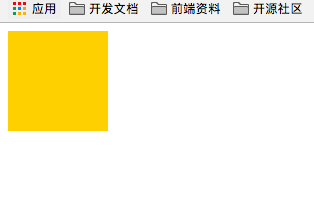

### 安装包

```
// less
 npm install less less-loader --save-dev

// sass
npm install node-sass sass-loader --save-dev

// 另外要装style-loader css-loader

npm install style-loader css-loader --save-dev
```

配置非常简单：

在module的rules下：

### less配置：

```js
const path = require('path');
module.exports = {
    mode: 'development',
    entry: {
        app: './src/app.js'
    },
    output: {
        filename: '[name].bundle.js',
        path: path.resolve(__dirname, 'dist'),
        publicPath: './dist/'
    },
    module: {
        rules: [
            {
                test: /\.less$/,
                use: [
                    {
                        loader: 'style-loader'
                    },
                    {
                        loader: 'css-loader'
                    },
                    {
                        // less-loader配置
                        loader: 'less-loader'
                    },

                ]
            }
        ]
    }

}
```

写一段less代码进行打包：

```less
@fontSize16: 16px;
@bgColor: red;

.box {
  width: 100px;
  height: 100px;
  font-size: @fontSize16;
  background: @bgColor;
}
```


### sass配置

```js
const path = require('path');
module.exports = {
    mode: 'development',
    entry: {
        app: './src/app.js'
    },
    output: {
        filename: '[name].bundle.js',
        path: path.resolve(__dirname, 'dist'),
        publicPath: './dist/'
    },
    module: {
        rules: [
            {
                test: /\.scss$/,
                use: [
                    {
                        loader: 'style-loader'
                    },
                    {
                        loader: 'css-loader'
                    },
                    {
                        // sass-loader配置
                        loader: 'sass-loader'
                    },

                ]
            }
        ]
    }

}
```

写一段scss样式测试:

```scss
$fontSize16: 16px;
$bgColor: #fc1;

.box {
  width: 100px;
  height: 100px;
  font-size: $fontSize16;
  background: $bgColor;
}
```


总结：如果配置less和sass，首先安装less-loader以后sass-loader的包，然后在rules下匹配文件后缀以及loader。
