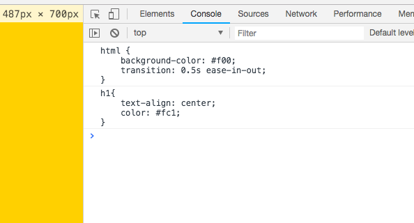

### webpack可以处理css什么?

```
引入css
css modules
配置less / sass
提出css代码
```

### 引入css处理方法

- style-loader
    - style-loader
    - style-loader/url
    - style-loader/useable
- css-loader

### 安装包

```js
npm install style-loader css-loader file-loader --save-dev
```

### 使用style-loader配置

将css-loader打包好的css代码以<style>标签的形式插入到html文件中。


```
module: {
    rules: [
        {
            test: /\.css$/,
            use: [
                {
                    loader: "style-loader"
                }, {
                    loader: 'css-loader'
                }
            ],
            exclude: /node_modules/,
        }
    ]
}
```


### 使用style-loader/url配置

将css-loader打包好的css代码以<link>文件的形式插入到html文件中。

```js
module: {
    rules: [
        {
            test: /\.css$/,
            use: [
                {
                    loader: "style-loader/url"
                }, {
                    loader: 'file-loader'
                }
            ],
            exclude: /node_modules/,
        }
    ]
}
```


### 使用style-loader/useable配置
将css-loader打包好的css代码以<link>文件的形式插入到html文件中。
可以使用use或unuse使用css代码

例如：

```js
module: {
    rules: [
        {
            test: /\.css$/,
            use: [
                {
                    loader: "style-loader/useable"
                }, {
                    loader: 'css-loader'
                }
            ],
            exclude: /node_modules/,
        }
    ]
}
```

### 在app.js写入代码测试：

```
import base from './css/base.css'
import common from './css/common.css'

// 使用base样式
base.use();

// 不使用common样式
common.unuse();
```

### Style-Loader options配置

options
- insertAt(插入位置)
- insertInto(插入到dom)
- singleton(是否只使用一个style标签)
- transform(转化，浏览器环境下，插入到页面前)

```
module: {
    rules: [
        {
            test: /\.css$/,
            use: [
                {
                    loader: "style-loader",
                    options: {
                        insertInto: '#app',
                        singleton: true,
                        transform: './css.transform.js'
                    }
                }, {
                    loader: 'css-loader'
                }
            ],
            exclude: /node_modules/,
        }
    ]
}
```

### insertInto需要使用一个id为app的div即可生效

```html
<div id="app"></div>
```

### singleton: true

```
只使用一个style标签
```

### transform需要新建一个文件来进行处理：

```js
//  ./css.transform.js，
module.exports = function (css) {
    console.log(css);

    // return css;

    if (window.innerWidth >= 768) {
        return css.replace('#f00', 'blue')
    } else {

        return css.replace('#f00', '#fc1')
    }
}
```

